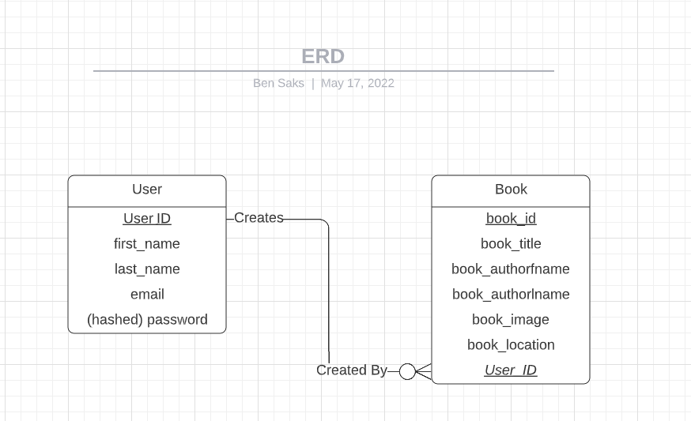
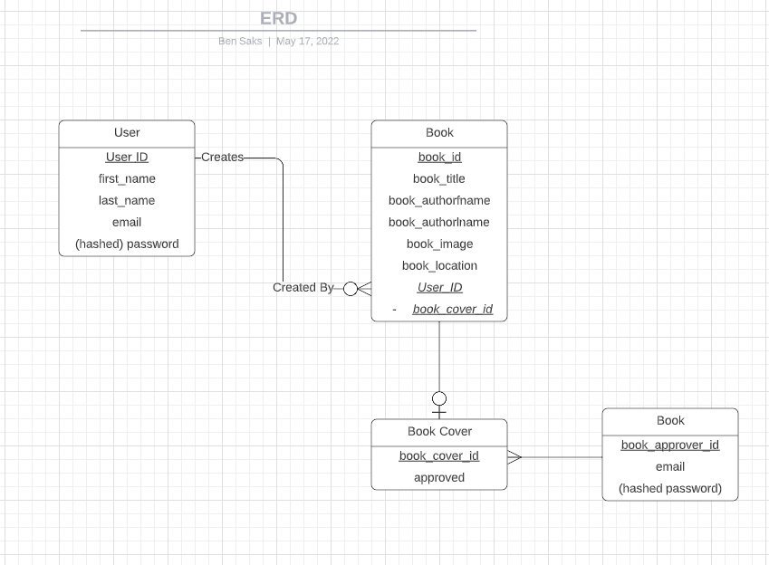
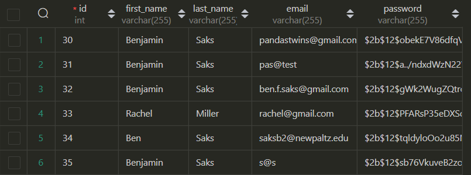
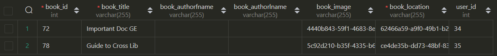

# CrossLibrary 
## A Web App to help students self study by allowing access to their textbooks from any computer instantly 
---
## Functionality: 
 - Users are able to create an account, login/logout 
 - User is able to create a **book** by uploading any pdf give it a title.
 - Automatically a book is assigned a cover photo based on the first page of the pdf 
 - User is able to read any of the books they create, able to logout and log back in to view the books. 

## Additional Add ons:
 - A better pdf viewer that you are able to track what page you left off on
 - Build it into a social media based application so users can get live comments at they are reading their book
 - Ability to link books in users library to a social page for that book (commenting, and making posts) 
 - Be able to mark up the pdf in browser (support for touch devices)

## Problems:
 - How to deal with mutiple large file being uploaded by the user **Solveed**
 - Being able to extract only the first photo of every pdf to be used as an icon **Solved**
 - Authentication per book based on the user 
 - Deploy Project

## Tools Used For This Project: 
- **Styling**: TailWindCSS
- **Frontend**: EJS
- **Backend**: NodeJS, Express, Bcrypt, pdf-poppler
- **Database**: MySql

## ERD:
 - Since I did not implement everything I had originally layed out here are my two ERD diagrams 
 - I just have user that is linked with every book a user creates by putting a foregin key in the book table that links back to the user 
 - The book just has all the important information related about the book such as book title, author, location of book, and location of cover.
 
 - Since I plan to make this a social media platform for books when someone creates a new page for a book I want it to be manually reviewed before users are able to view it. 
 

## Run Project 
 - install packages with:
 `npm i `
 - run script with: 
 `npm run server`
 - any additional css changes:
 `npm run build:css` 
 - setup users table

- setup books table
 - user_id is foregin key here

## Guide to website
[Cross Library Guide](./CrossLibrary.pdf)
